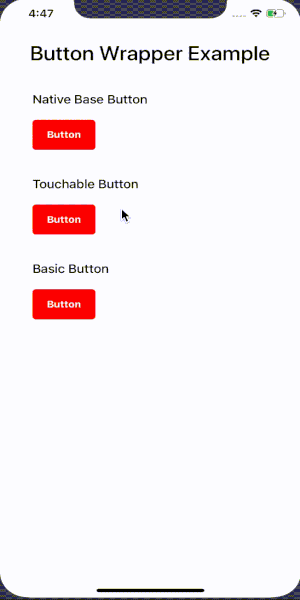

# react-native-button-wrapper

This npm resolve the multiple click issue on a button.



# Setup
### Installation

`$ npm install react-native-button-wrapper --save`

or

`$ yarn add react-native-button-wrapper`

### Link the library

`$ react-native link react-native-button-wrapper`

## Usage

### Props   
##### Props you may need to pass while implementing. This wrapper default extends the properties of the touchable Opacity.

| Prop           |     Default     |   Type   | Description                                                                                                 |
| :------------- | :-------------: | :------: | :---------------------------------------------------------------------------------------------------------- |
| onPress     |      () => {}       |  `function`  | This methods gets called if you click the button once. |
| onDoublePress           |      () => {}       |  `function`  | This methods gets called if you click the button twice. |
| useNativeBase          |       false        | `bool` | If `true`, the wrapper will return the native base button component.                                                                              |

### Basic
```javascript

import ButtonWrapper from 'react-native-button-wrapper';

function Button() {
  return (
    <ButtonWrapper
      onPress={() => {
       <!--- gets called only once even if you clicked twice --->
      }}
     >
      <Text>Button</Text>              
     </ButtonWrapper>
   );
 }
```

### Native Base Implementation
```javascript

import ButtonWrapper from 'react-native-button-wrapper';


function Button() {
  return (
    <ButtonWrapper
      useNativeBase
      onDoublePress={() => {
       <!--- gets called when you double clicked on the button  --->
      }}
      onPress={() => {
       <!--- gets called when you single clicked on the button --->
      }}
    >
      <Text>Button</Text>              
    </ButtonWrapper>
  );
}
```
